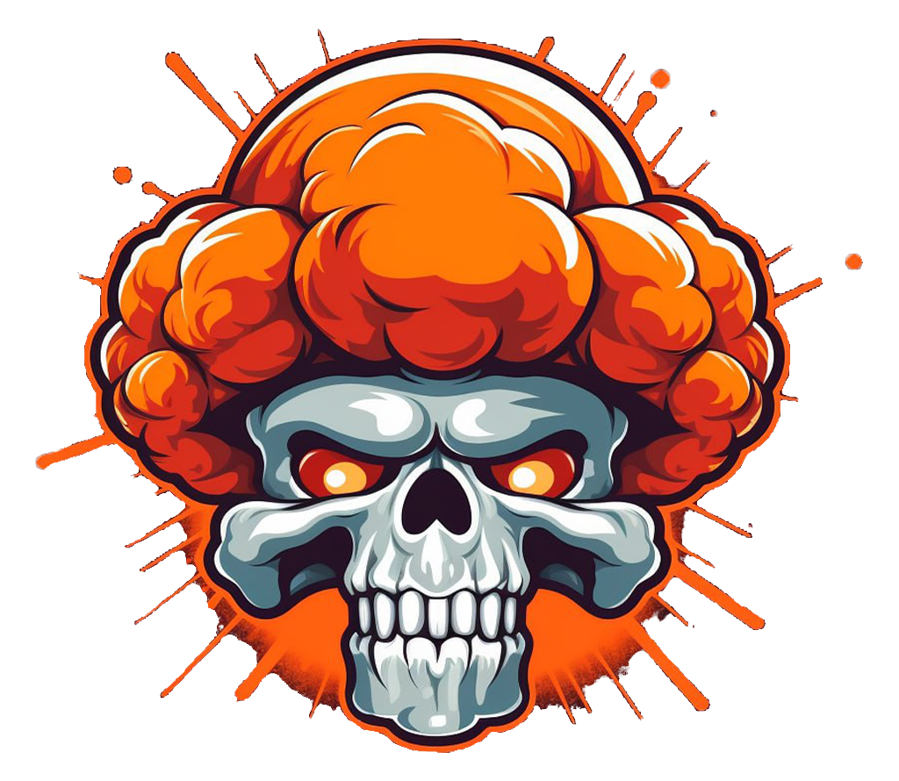

# :lucide-computer: Sources 

{align=right width=200}

## ARMGDDN

A massive community-driven resource hub specializing in high-speed access to PC and PCVR games. Known for its extensive library of repacks and untouched releases, ARMGDDN provides a streamlined experience for users building their local collections.

[:lucide-home:](https://github.com/KaladinDMP/AGBrowser){ .card-link title=Homepage }
[:fontawesome-brands-telegram:](https://t.me/ARMGDDNGames){ .card-link title=Telegram}

### Resources & Tools

- Primary Source: Large repository featuring high-quality releases for PC and VR gaming.
- Access Method: Powered by rclone and accessed through the [ARMGDDN Browser](https://github.com/KaladinDMP/AGBrowser/releases/download/v6.0.0-AGB/SETUP.7z) for secure and simplified navigation of the library.
- Game Requests: Active request system where new titles and updates are managed and tracked directly by the team.

ARMGDDN is a top-tier source for users who want a dedicated, secure interface via their custom browser. Their Telegram community is the central hub for real-time support and the fastest updates on new PC/PCVR content.